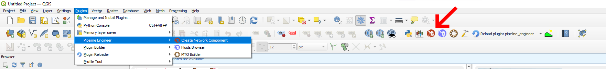
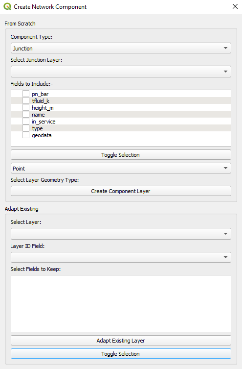
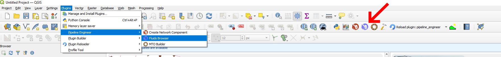
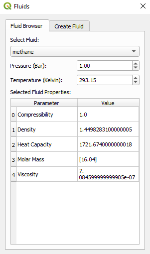
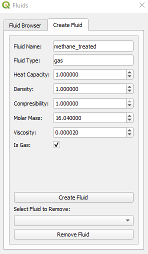

Pipeline Engineer's Fluid Modelling capabilities heavily leverage the [Pandapipes](https://www.pandapipes.org/) Python library. The following sections detail how to use Pipeline Engineer for modelling networks.

# 1 Component Creation

Layers are either created or abstracted from the 'Create Network Component' Dialog that can be accessed either from the QGIS toolbar or plugin menu:-



Networks can be created from scratch of abstracted directly from existing GIS layers (it helps if the layers being extracted from are topologically consistent, however, users can modify the network after the fact if needed).



# 2 Fluid Creation

The 'Fluids' Dialog is also available from either the toolbar or the Plugin menu:-



Fluids properties can be viewed on the 'Browser' tab in the 'Fluids' Dialog:-



Users can create Fluids on the 'Create Fluid' tab of the 'Fluids' Dialog:-



# 3 Fluid Modelling Algorithms

All of Pipeline Engineer's fluid modelling algorithms are available can be used directly from the QGIS Processing Toolbox.

This has the added benefit of allowing users to automate repetitive workflows, meaning users can automate the simulation of various scenarios.

The following sections detail the algorithms currently available and how they can be utilised in Python Scripts.

# 3.1 Add Parameter to Fluid Layer

Adds a fluid parameter at a specified pressure and temperature to a selected layer's attribute table.

## 3.1.1 Parameters

| Label                          | Name                  | Type                             | Description    |
| -------------------------------|-----------------------|----------------------------------|----------------|
Input layer                      | `INPUT`               |[vector: any]                |Layer user wishes to add fluid parameter to|
Select Fluid | `FLUID`               |[enumeration] Default: 0          |Fluid from  which properties will be selected:- <br> 0 - hgas <br>1 - lgas <br>2 - hydrogen  <br>3 - methane <br>4 - water <br>5 - biomethane_pure <br>6 - biomethane_treated <br>7 - air|
Disjoint Check Selected Feature? | `PARAMETER`           |[enumeration] Default: 1          |Fluid parameter that that will be added to attribute table:- <br> 0 - compressibility <br> 1 - density <br> 2 - heat capacity <br> 3 - molar mass <br> 4 - viscosity              |
Disjoint Check Selected Feature? | `TEMP`                |[numeric: double] Default: 293.15 | Temperature of fluid|
Disjoint Check Selected Feature? | `PRES`                |[numeric: double] Default: 1.00   | Pressure of fluid |
Disjoint Check Selected Feature? | `ADD_FLUID`           |[boolean] Default: True           | Adds chosen fluid to attribute table when checked|

## 3.1.2 Outputs

| Label           | Name                   | Type                   | Description            |
| ----------------|----------------------- |----------------------- |----------------------- |
Parameter added      | `OUTPUT`          |[vector: any]| Returns with fluid parameter added |

## 3.1.3 Python Code

```py

import processing

processing.run("algorithm_id", {parameters_dictionary})

```
# 3.2 Run Pipeflow
The core pipeflow functionality relies leverages the fluid modelling tools from the [pandapipes](https://pandapipes.readthedocs.io/en/latest/pipeflow/run.html) Python Library.

## 3.2.1 Parameters

| Label                          | Name                   | Type                   | Description            |
| ------------------------------ |----------------------- |----------------------- |----------------------- |
| Select Network Layers          | `LAYERS`               | [vector: any] [list]   | Layers within the pipe network being analysed. See [Network Component Creator](/admonitions/) for more details|
| Select Fluid                   | `FLUID`                |[enumeration] Default: 0| Fluid Pipeflow will be carried out using:- <br> 0 - hgas <br>1 - lgas <br>2 - hydrogen  <br>3 - methane <br>4 - water <br>5 - biomethane_pure <br>6 - biomethane_treated <br>7 - air|
| Calculation Mode               |`CALC_MODE`             |[enumeration] Default: 0|Calculation Mode of pipeflow:- <br>0 - hydraulics <br> 1 - bidirectional <br> 2 - sequential|
| Maximum Iterations (Hydraulic) |`MAX_ITER_HYD`          |[numeric: double] Default: 10000|Refer to [Pipeflow Options](https://pandapipes.readthedocs.io/en/latest/pipeflow/options.html)|
| Maximum Iterations (Thermal)   |`MAX_ITER_THERM`        |[numeric: double] Default: 10000|Refer to [Pipeflow Options](https://pandapipes.readthedocs.io/en/latest/pipeflow/options.html)|
| Pressure Error Tolerance       |`PRES_TOL`              |[numeric: double] Default: 0.0001|Refer to [Pipeflow Options](https://pandapipes.readthedocs.io/en/latest/pipeflow/options.html)|
| Velocity Error Tolerance       |`VEL_TOL`               |[numeric: double] Default: 0.0001|Refer to [Pipeflow Options](https://pandapipes.readthedocs.io/en/latest/pipeflow/options.html)|
| Temperature Error Tolerance    |`TEMP_TOL`              |[numeric: double] Default: 0.0001|Refer to [Pipeflow Options](https://pandapipes.readthedocs.io/en/latest/pipeflow/options.html)|
| Residual Tolerance             |`RES_TOL`               |[numeric: double] Default: 0.001|Refer to [Pipeflow Options](https://pandapipes.readthedocs.io/en/latest/pipeflow/options.html)|
| Ambient Temperature            |`AMBIENT_TEMP`          |[numeric: double] Default: 293.15|Refer to [Pipeflow Options](https://pandapipes.readthedocs.io/en/latest/pipeflow/options.html)|
| Friction Model                 |`FRIC_MODEL`            |[enumeration] Default: 1|Refer to [Pipeflow Options](https://pandapipes.readthedocs.io/en/latest/pipeflow/options.html)|
| Alpha                          |`ALPHA`                 |[numeric: double] Default: 1|Refer to [Pipeflow Options](https://pandapipes.readthedocs.io/en/latest/pipeflow/options.html) |
| Nonlinear Method               |`NONLINEAR_METHOD`      |[enumeration] Default: 0|Refer to [Pipeflow Options](https://pandapipes.readthedocs.io/en/latest/pipeflow/options.html)|
| Update Hydraulic Matrix Only?  |`UPDATE_HYD_ONLY`       |[boolean] Default: False|Refer to [Pipeflow Options](https://pandapipes.readthedocs.io/en/latest/pipeflow/options.html)|
| Check Connectivity?            |`CHECK_CONNECTIVITY`    |[boolean] Default: True |Refer to [Pipeflow Options](https://pandapipes.readthedocs.io/en/latest/pipeflow/options.html)|
| Quit on Inconsistency?         |`QUIT_ON_INCONSISTENCY` |[boolean] Default: False|Refer to [Pipeflow Options](https://pandapipes.readthedocs.io/en/latest/pipeflow/options.html)|
| Use Numba?                     |`USE_NUMBA`             |[boolean] Default: True |Refer to [Pipeflow Options](https://pandapipes.readthedocs.io/en/latest/pipeflow/options.html)|

## 3.2.2 Outputs

| Label           | Name                   | Type                   | Description            |
| ----------------|----------------------- |----------------------- |----------------------- |
Load Layers?      | `LOAD_LAYERS`          |[boolean] Default: True | When checked, will load result files to a temporary layer|
Output Geopackage | `OUTPUT`               |[file] Default: [Save to temporary file]| Will save result layers to specified output (will save to temporary file by default)|

## 3.2.3 Python Code

```py

import processing

processing.run("algorithm_id", {parameters_dictionary})

```

# 3.3 Run Pipeflow (Beggs Brill)

Runs a regular pandapipes pipeflow over a specified fluid to obtain flow distribution. Will then reverse all lines that are flowing in the opposite direction of the line geometry. Beggs and Brill correlation will be calculated from grid connections until the pressure drop along every section of pipe containing service has been calculated.

NOTE:- At this moment, two-phase flow modules only work in cases where flow is towards pressure boundaries - this will be rectified to include all flow directions in the near future.

## 3.3.1 Parameters

| Label                          | Name                   | Type                   | Description            |
| ------------------------------ |----------------------- |----------------------- |----------------------- |
| Select Network Layers          | `LAYERS`               | [vector: any] [list]   | Layers within the pipe network being analysed. See [Network Component Creator](/admonitions/) for more details|
| Select Fluid                   | `PIPEFLOW_FLUID`       |[enumeration] Default: 0| Fluid Pipeflow will be carried out using:- <br> 0 - hgas <br>1 - lgas <br>2 - hydrogen  <br>3 - methane <br>4 - water <br>5 - biomethane_pure <br>6 - biomethane_treated <br>7 - air|
| Select Liquid Phase            | `LIQUID`               |[enumeration] Default: 0| Liquid Phase of fluid:- <br> 0 - water|
| Select Gas Phase               | `GAS`                  |[enumeration] Default: 0| Fluid Pipeflow will be carried out using:- <br> 0 - hgas <br>1 - lgas <br>2 - hydrogen  <br>3 - methane <br>4 - biomethane_pure <br>5 - biomethane_treated <br>6 - air|
| Gas Fraction                   |`GAS_FRACTION`          |[numeric: double] Default: 0.5| Fraction of total flow rate that is a gaseous phase|
| Surface Tension                |`SURF_TENS`             |[enumeration] Default: 0.072  | Surface tension of liquid phase (N/m)|
| Maximum Iterations (Hydraulic) |`MAX_ITER_HYD`          |[numeric: double] Default: 10000|Refer to [Pipeflow Options](https://pandapipes.readthedocs.io/en/latest/pipeflow/options.html)|
| Maximum Iterations (Thermal)   |`MAX_ITER_THERM`        |[numeric: double] Default: 10000|Refer to [Pipeflow Options](https://pandapipes.readthedocs.io/en/latest/pipeflow/options.html)|
| Pressure Error Tolerance       |`PRES_TOL`              |[numeric: double] Default: 0.0001|Refer to [Pipeflow Options](https://pandapipes.readthedocs.io/en/latest/pipeflow/options.html)|
| Velocity Error Tolerance       |`VEL_TOL`               |[numeric: double] Default: 0.0001|Refer to [Pipeflow Options](https://pandapipes.readthedocs.io/en/latest/pipeflow/options.html)|
| Temperature Error Tolerance    |`TEMP_TOL`              |[numeric: double] Default: 0.0001|Refer to [Pipeflow Options](https://pandapipes.readthedocs.io/en/latest/pipeflow/options.html)|
| Residual Tolerance             |`RES_TOL`               |[numeric: double] Default: 0.001|Refer to [Pipeflow Options](https://pandapipes.readthedocs.io/en/latest/pipeflow/options.html)|
| Ambient Temperature            |`AMBIENT_TEMP`          |[numeric: double] Default: 293.15|Refer to [Pipeflow Options](https://pandapipes.readthedocs.io/en/latest/pipeflow/options.html)|
| Friction Model                 |`FRIC_MODEL`            |[enumeration] Default: 1|Refer to [Pipeflow Options](https://pandapipes.readthedocs.io/en/latest/pipeflow/options.html)|
| Alpha                          |`ALPHA`                 |[numeric: double] Default: 1|Refer to [Pipeflow Options](https://pandapipes.readthedocs.io/en/latest/pipeflow/options.html) |
| Nonlinear Method               |`NONLINEAR_METHOD`      |[enumeration] Default: 0|Refer to [Pipeflow Options](https://pandapipes.readthedocs.io/en/latest/pipeflow/options.html)|
| Update Hydraulic Matrix Only?  |`UPDATE_HYD_ONLY`       |[boolean] Default: False|Refer to [Pipeflow Options](https://pandapipes.readthedocs.io/en/latest/pipeflow/options.html)|
| Check Connectivity?            |`CHECK_CONNECTIVITY`    |[boolean] Default: True |Refer to [Pipeflow Options](https://pandapipes.readthedocs.io/en/latest/pipeflow/options.html)|
| Quit on Inconsistency?         |`QUIT_ON_INCONSISTENCY` |[boolean] Default: False|Refer to [Pipeflow Options](https://pandapipes.readthedocs.io/en/latest/pipeflow/options.html)|
| Use Numba?                     |`USE_NUMBA`             |[boolean] Default: True |Refer to [Pipeflow Options](https://pandapipes.readthedocs.io/en/latest/pipeflow/options.html)|

## 3.3.2 Outputs

| Label           | Name                   | Type                   | Description            |
| ----------------|----------------------- |----------------------- |----------------------- |
Load Layers?      | `LOAD_LAYERS`          |[boolean] Default: True | When checked, will load result files to a temporary layer|
Output Geopackage | `OUTPUT`               |[file] Default: [Save to temporary file]| Will save result layers to specified output (will save to temporary file by default)|

## 3.3.3 Python Code

```py

import processing

processing.run("algorithm_id", {parameters_dictionary})

```
# 3.4 Run Pipeflow (Homogenous Model)

Runs a regular pandapipes pipeflow over a specified fluid to obtain flow distribution. Will then reverse all lines that are flowing in the opposite direction of the line geometry. A homogenous two-phase model (i.e. constant gas & liquid velocity) is used to back-calculate the pressure from the grids outwards.

NOTE:- At this moment, two-phase flow modules only work in cases where flow is towards pressure boundaries - this will be rectified to include all flow directions in the near future.

## 3.4.1 Parameters

| Label                          | Name                   | Type                   | Description            |
| ------------------------------ |----------------------- |----------------------- |----------------------- |
| Select Network Layers          | `LAYERS`               | [vector: any] [list]   | Layers within the pipe network being analysed. See [Network Component Creator](/admonitions/) for more details|
| Select Fluid                   | `PIPEFLOW_FLUID`       |[enumeration] Default: 0| Fluid Pipeflow will be carried out using:- <br> 0 - hgas <br>1 - lgas <br>2 - hydrogen  <br>3 - methane <br>4 - water <br>5 - biomethane_pure <br>6 - biomethane_treated <br>7 - air|
| Select Liquid Phase            | `LIQUID`               |[enumeration] Default: 0| Liquid Phase of fluid:- <br> 0 - water|
| Select Gas Phase               | `GAS`                  |[enumeration] Default: 0| Fluid Pipeflow will be carried out using:- <br> 0 - hgas <br>1 - lgas <br>2 - hydrogen  <br>3 - methane <br>4 - biomethane_pure <br>5 - biomethane_treated <br>6 - air|
| Gas Fraction                   |`GAS_FRACTION`          |[numeric: double] Default: 0.5| Fraction of total flow rate that is a gaseous phase|
| Surface Tension                |`SURF_TENS`             |[enumeration] Default: 0.072  | Surface tension of liquid phase (N/m)|
| Maximum Iterations (Hydraulic) |`MAX_ITER_HYD`          |[numeric: double] Default: 10000|Refer to [Pipeflow Options](https://pandapipes.readthedocs.io/en/latest/pipeflow/options.html)|
| Maximum Iterations (Thermal)   |`MAX_ITER_THERM`        |[numeric: double] Default: 10000|Refer to [Pipeflow Options](https://pandapipes.readthedocs.io/en/latest/pipeflow/options.html)|
| Pressure Error Tolerance       |`PRES_TOL`              |[numeric: double] Default: 0.0001|Refer to [Pipeflow Options](https://pandapipes.readthedocs.io/en/latest/pipeflow/options.html)|
| Velocity Error Tolerance       |`VEL_TOL`               |[numeric: double] Default: 0.0001|Refer to [Pipeflow Options](https://pandapipes.readthedocs.io/en/latest/pipeflow/options.html)|
| Temperature Error Tolerance    |`TEMP_TOL`              |[numeric: double] Default: 0.0001|Refer to [Pipeflow Options](https://pandapipes.readthedocs.io/en/latest/pipeflow/options.html)|
| Residual Tolerance             |`RES_TOL`               |[numeric: double] Default: 0.001|Refer to [Pipeflow Options](https://pandapipes.readthedocs.io/en/latest/pipeflow/options.html)|
| Ambient Temperature            |`AMBIENT_TEMP`          |[numeric: double] Default: 293.15|Refer to [Pipeflow Options](https://pandapipes.readthedocs.io/en/latest/pipeflow/options.html)|
| Friction Model                 |`FRIC_MODEL`            |[enumeration] Default: 1|Refer to [Pipeflow Options](https://pandapipes.readthedocs.io/en/latest/pipeflow/options.html)|
| Alpha                          |`ALPHA`                 |[numeric: double] Default: 1|Refer to [Pipeflow Options](https://pandapipes.readthedocs.io/en/latest/pipeflow/options.html) |
| Nonlinear Method               |`NONLINEAR_METHOD`      |[enumeration] Default: 0|Refer to [Pipeflow Options](https://pandapipes.readthedocs.io/en/latest/pipeflow/options.html)|
| Update Hydraulic Matrix Only?  |`UPDATE_HYD_ONLY`       |[boolean] Default: False|Refer to [Pipeflow Options](https://pandapipes.readthedocs.io/en/latest/pipeflow/options.html)|
| Check Connectivity?            |`CHECK_CONNECTIVITY`    |[boolean] Default: True |Refer to [Pipeflow Options](https://pandapipes.readthedocs.io/en/latest/pipeflow/options.html)|
| Quit on Inconsistency?         |`QUIT_ON_INCONSISTENCY` |[boolean] Default: False|Refer to [Pipeflow Options](https://pandapipes.readthedocs.io/en/latest/pipeflow/options.html)|
| Use Numba?                     |`USE_NUMBA`             |[boolean] Default: True |Refer to [Pipeflow Options](https://pandapipes.readthedocs.io/en/latest/pipeflow/options.html)|

## 3.4.2 Outputs

| Label           | Name                   | Type                   | Description            |
| ----------------|----------------------- |----------------------- |----------------------- |
Load Layers?      | `LOAD_LAYERS`          |[boolean] Default: True | When checked, will load result files to a temporary layer|
Output Geopackage | `OUTPUT`               |[file] Default: [Save to temporary file]| Will save result layers to specified output (will save to temporary file by default)|

## 3.4.3 Python Code

```py

import processing

processing.run("algorithm_id", {parameters_dictionary})

```