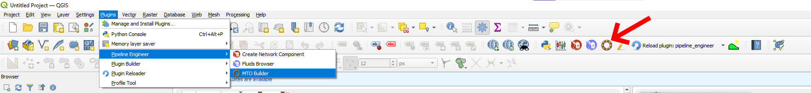
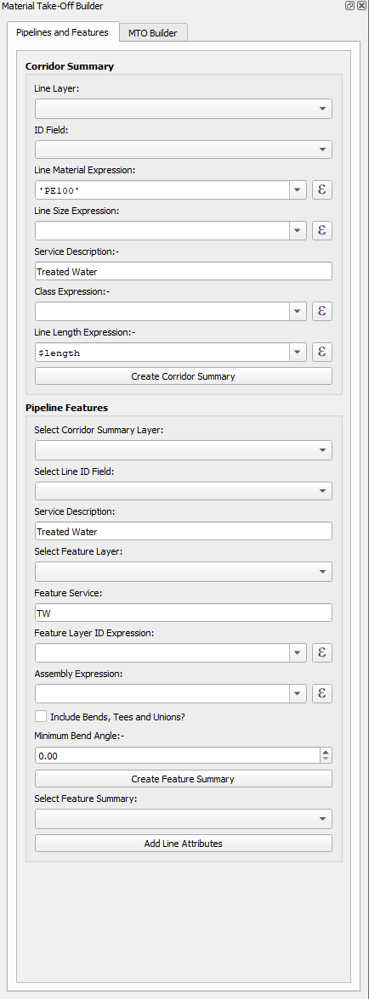
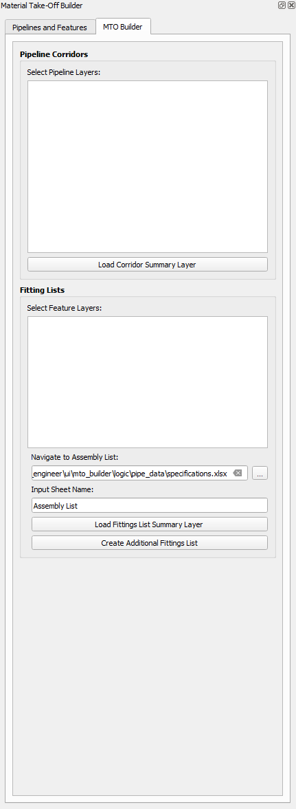

The MTO Builder can be accessed from either the Toolbar or the Plugin Menu.

The following sections will detail how the MTO Builder works.

# 1 Pipelines and Features

The purpose of the Pipelines and Features tab is to help identify each point where fittings in the network will be needed. Summaries for line layers representing Pipelines can be obtained easily.

Sizes, classes and lengths can be extracted either directly from an existing field of an attribute table, or using a function.

Following this, point layers representing pipeline features (e.g. valves, end caps, etc.) can be summarised along with the corresponding corridor from the selected line layer.

The Feature ID and Assembly type again, can be taken either directly from the attribute table, or through an expression.

When checked, the Include Bends, Tees and Unions tab will add Bends, Tees and Four-way Unions to the feature layer. Once the useer has checked the feature summary and is happy with the corridors assigned, line attributes (i.e. size and class) can be added to each pipeline feature.

# 2 MTO Builder

THe MTO Builder contains a corridor summariser. The corridor summariser creates a list of each corridor and what pipelines will be installed in each one, along with their length, size and class.

The Fitting Lists area works by combining an assembly list located in an excel file inside the Pipeline Engineer Plugin. Users can navigate to a locally saved or modified verison of this workbook.

The Fittings Summary Layer uses the assembly list to pull each fitting and the relevant size from the Pipeline Feature Layer. Users can add their own assemblies to the assembly list as needed.

Additional Fittings can be captured either as an entry on this list or on a seperate list made from pressing the create additional fittings list. This is so that if a project goes through multiple iterations, Additional Fittings not on the assembly list can be accounted for if the fittings summary layer needs to be regenerated.
