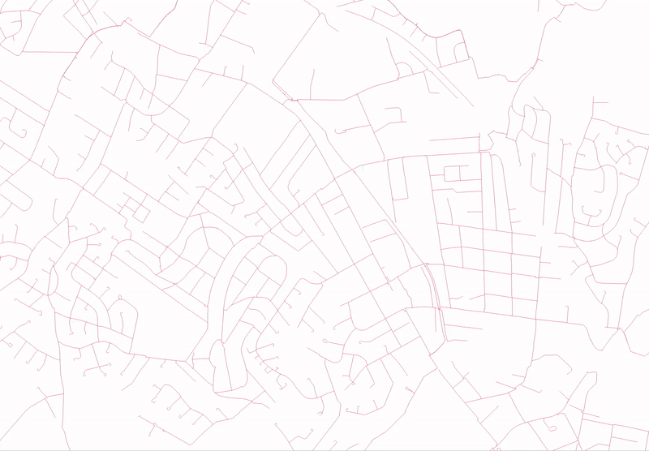
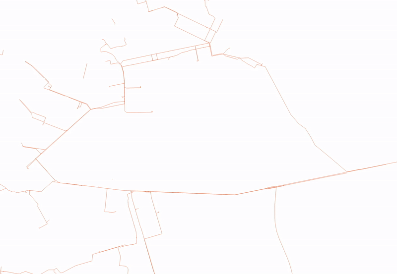

A collection of tools to aid fixing the topology of a network.


## 1 - Disjoint Check
Selects all lines connected to a line, repeats the process until no new lines are being selected.




### 1.1 Parameters

| Label                          | Name                  | Type                    | Description    |
| -------------------------------|-----------------------|-------------------------|                |
Input layer                      | `INPUT`               |[vector: line]           | Line layer user wishes to run disjoint check on |
Disjoint Check Selected Feature? | `CHECK_SELECTED`      |[boolean] Default: False | When checked, disjoint check will be run on currently selected lines on layer. When unchecked, disjoint check will be run on a random line |

### 1.2 Python Code

```py

import processing

processing.run("algorithm_id", {parameters_dictionary})

```

## 2 - Recursive Selection
Similar to Disjoint Check, however takes into account directionality. Will terminate when no more lines end at the start of any currently selected lines.

### 2.1 Parameters

| Label                          | Name                  | Type                    | Description    |
| -------------------------------|-----------------------|-------------------------|                |
Input layer                      | `INPUT`               |[vector: line]           | Line layer user wishes to run recursive selection on |

### 2.2 Python Code

```py

import processing

processing.run("algorithm_id", {parameters_dictionary})

```

## 3 - Loop Check

Dissolves all lines marked loop (any non-null values in a specified column) and splits them with those same lines. Users can select the loops and easily identify any topological errors.



### 3.1 Parameters

|Label                            |Name                   |Type                     |Description                                  |
|---------------------------------|-----------------------|-------------------------|---------------------------------------------|
|Input layer                      | `INPUT`               |[vector: line]           | Line layer user wishes to run loop check on |
|Loop Field | `ID_FIELD`      |[tablefield: any]  Default: Not set | field containing whether a layer is part of a loop (requires user to manually check identify all loops in line layer - all layers containing loops should have a non-NULL value in this column) |

### 3.2 Outputs

|Label                      |Name                    |Type                     |Description                                  |
|---------------------------|------------------------|-------------------------|---------------------------------------------|
|Loops                      | `OUTPUT`               |[vector: line]           | Returns a layer split with lines - all loops should be broken at intersection points only - any that are not are discontinuities that need to be rectified in the geometry |

### 3.3 Python Code

```py

import processing

processing.run("algorithm_id", {parameters_dictionary})

```

## 4 - Merge Selected Features Layers

Merges selected features from multiple layers into one layer.

### 4.1 Parameters

|Label                            |Name                   |Type                     |Description                                  |
|---------------------------------|-----------------------|-------------------------|---------------------------------------------|
| Select Line Layers          | `LAYERS`               | [vector: line] [list]   | Layers within the pipe network being analysed. See [Network Component Creator](/admonitions/) for more details|
|Loop Field | `ID_FIELD`      |[tablefield: any]  Default: Not set | field containing whether a layer is part of a loop (requires user to manually check identify all loops in line layer - all layers containing loops should have a non-NULL value in this column) |